# R2 Use appropriate libraries

## Front-End

- *react-datepicker* : Enables use of date picking gui for user to select a date
- *react-router-dom* : Routing library for React Javascript library.
- *testing-library* : For Unit and Integration testing of front end components
- *react* : Javascript library for building user interfaces with components
- *vite-react* : A build tool that provides a dev server for development and build command for production
- *msw*: A REST api mocking library for browser and node to intercept requests.
- *vitest*: Front end component Unit and integration testing library

## Back-End

- "*bcryptjs*": Provides hashing library and algortithm to convert passwords to hash strings
- "*cors*": Node.js library that provides Express middleware to enable CORS options
- "*dotenv*": Library to automatically load environment variables from a file to the project
- "*express*": Node.js web application framework for routing and handling http requests
- "*jsonwebtoken*": Provides a library to deal with the supply/encoding/decoding of JSON Web Tokens for Authorisation and Authentication purposes
- "*mongodb*": A driver for interacting with MongoDB databases
- "*mongoose*": An Object Data Modeleing library for MongoDB. Uses document oriented models and Schemas to interact with MongoDb documents and Collections
- "*multer*": Node.js middleware for handling multipart/form-data for uploading files such as images.
- *"multer-gridfs-storage"*: Ftorage engine for Multer Node.js middleware to facilitate file uploads. 
- *nodemon*: A tool library to develop node applications by automatically restarting application whenever changes are made

# R10  A link (URL) to your deployed website

## Client

https://client-production-4fee.up.railway.app/

## Server

https://server-production-f312.up.railway.app/

## Client

https://client-production-4fee.up.railway.app/

## Server

https://server-production-f312.up.railway.app/

  - For the admin login:
    - ACC: admin@bookstore.com
    - Password: admin

# R11 A link to your GitHub repository (repo)

---

    - Whole Main App (Book Exchange App)
      - https://github.com/Book-Exchange-APP

    - Front-End
      - https://github.com/Book-Exchange-APP/Client

    - Back-End
      - https://github.com/Book-Exchange-APP/Server

    - Documentation
      - https://github.com/Book-Exchange-APP/Docs

# R12 The contents of your README.md as submitted for Full Stack App - Part A

---
### R1 Description of your website, including

- Purpose

This app will provide a way for people to exchange books, find out about new books and obtain a new book to read without having to pay.

- Functionality / features

  1. MVP features are:
      - General users can view the list of the books available or pending for exchange.
      - General users can view the details of each book.
      - General users can search books by category (e.g. author, title, language, genre, etc.) or by location.
      - General users can make an appointment for book exchange with their preferred time and the details of their own book to be exchanged.
      - The books' status can be updated automatically to pending once one appointment is made on it.
      - Admin can update the status of the exchanged book to available again or confirm the success of the exchange (login required).

  2. Advanced features are:
       - General users can view/edit their appointment.
       - General users can view their own profile.
       - General users can view their book list.

- Target audience

This app is designed and developed for a voluntary community of readers or book lovers or those who would like to share their loved books with others.

- Tech stack
  
  - MongoDB
  - Mongoose
  - Express
  - React
  - Node
  - HTML
  - CSS
  - Jest
  - Vitest
  - Supertest
  - Cors
  - Vite
  - Bootstrap
  - Railway

### R2 Dataflow Diagram

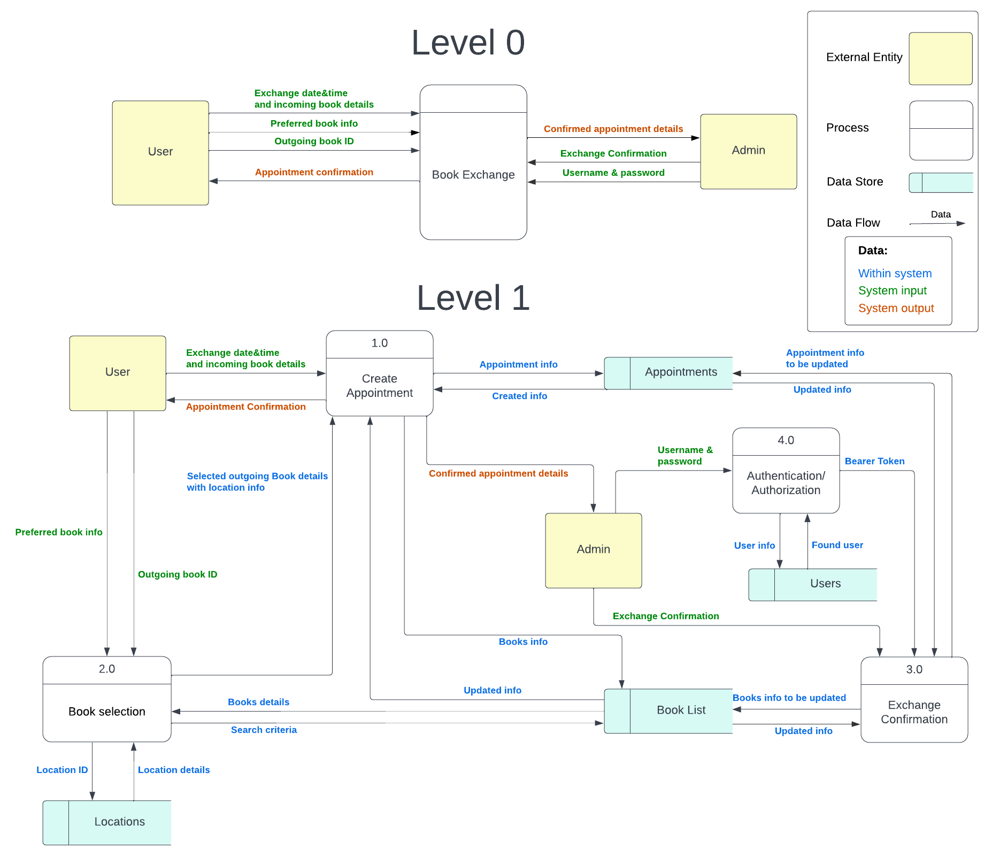

### R3 Application Architecture Diagram

1. The web browser that the user interacts with directly. The user can access the server by using different devices such as mobile, tablet and laptop etc,. This is the only section that the user directly uses, because the browser will send the request and receive the response from the Front-end and display it.

2. This part is written in React, CSS, JavaScript and HTML. It is represented as a Front-end by receiving the HTTP request from the users and it will receive the data and function by sending the JSON request to the back-end. Once it receives the response from the back-end then the front-end can send the render to the browser by a HTTP response.
In the Front-End, there are seven components which are Home, Books, Appointment, Confirmation, Login, Dashboard and Contact, and each component will send the JSON request to the Back-End for getting the data to display to the web browser. Besides, Display one book in the Appointment component is linking to Books and Home components by using the 'Display books' function.
Also, the Appointment component is linking to Confirmation component since the user submitted the appointment from, and the Dashboard component requires Login component for the admin to confirm and cancel the appointments. Moreover, it will get tested and deployed by using the Railway.

3. This part is a Back-End by using Express.js, Node.js and JavaScript. It is for receiving the JSON request from the Front-End and then it will match the route, query the MongoDB database and then send the response back to the Front-End. Each API may receive a request from different components based on the functionalities and features.
For example, the Books API will receive the request to GET(display) the data of the books details and then it will match and query the database to get the data. The Appointment API will receive a request to POST(create) a new appointment, PUT(update) the selected appointment and GET(display) appointments. Also, the Authorization API will receive the request from the Login component ,and then the API will query the data from the Users database and send the user token back.
Some of the components will send a request to the Location API to GET (display) the data of the location details from the database. Moreover, it will get tested and deployed by using the Railway.

4. This part is a database by using MongoDB Atlas. The database mainly has four collections to store the documents, which are Books, Appointments, Users and Locations. The database will receive the queries from the Back-End by using mongoose and then store, retrieve and edit the documents in the database. Once the database completes document manipulation, it will send the found document back to the Back-End.

### R4 User Stories

In general, 

- As readers (i.e. general users), they want to know if there are any books that they are interested in and available for exchange around their area, so that they can use their own books to exchange.
- As readers (i.e. general users), they want to know the details of the books available for exchange, so that they can decide to exchange or not.
- As readers (i.e. general users), they want to select a book from the app to exchange with their own book.
- As readers (i.e. general users), they want to make an appointment for exchange, so that they can make an arrangement.
- As readers (i.e. general users), they want to know the status of their preferred book, so that they can tell if an exchange is available for that book.
- As admins, they want to edit the status of the pending books, so that the readers can be updated in time about the exchange.

Furthermore,

- As readers (i.e. general users), they want to view their appointments, so that they can set up a reminder.
- As readers (i.e. general users), they want to edit their appointments, so that they can make an amendment if something unexpected happens.
- As readers (i.e. general users), they want to view the list of books they have exchanged, so that they can have a record.

### R5 Wireframes for multiple standard screen sizes, created using industry standard software

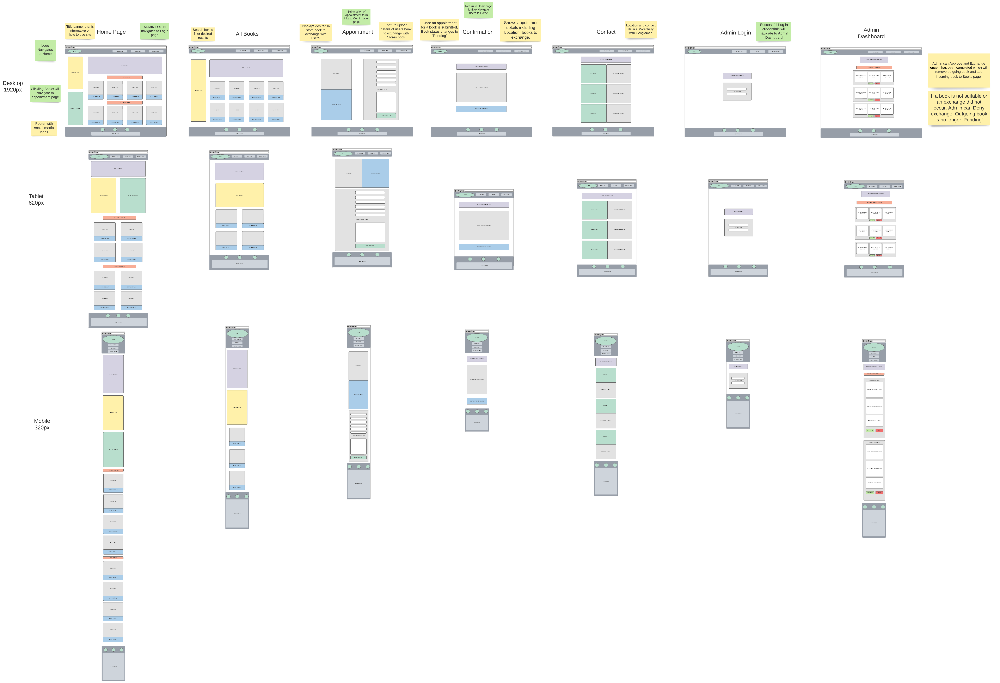

### R6 Screenshots of your Trello board throughout the duration of the project

Day 1 - Tue 17 Jan

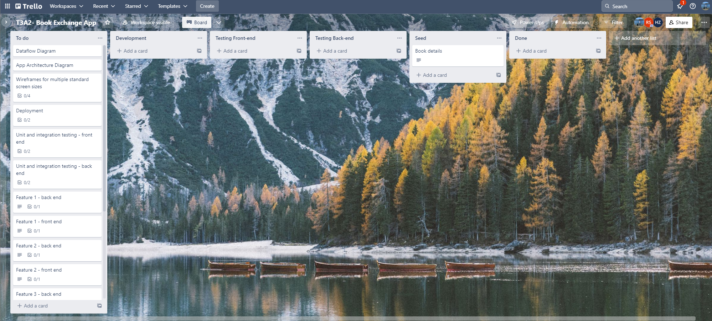

Day 2 - Wed 18 Jan

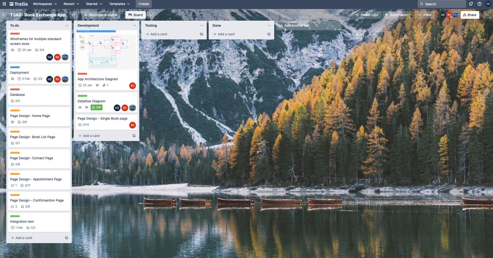

Day 3 - Thu 19 Jan

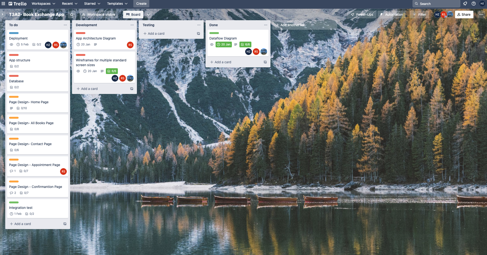

Day 4 - Fri 20 Jan

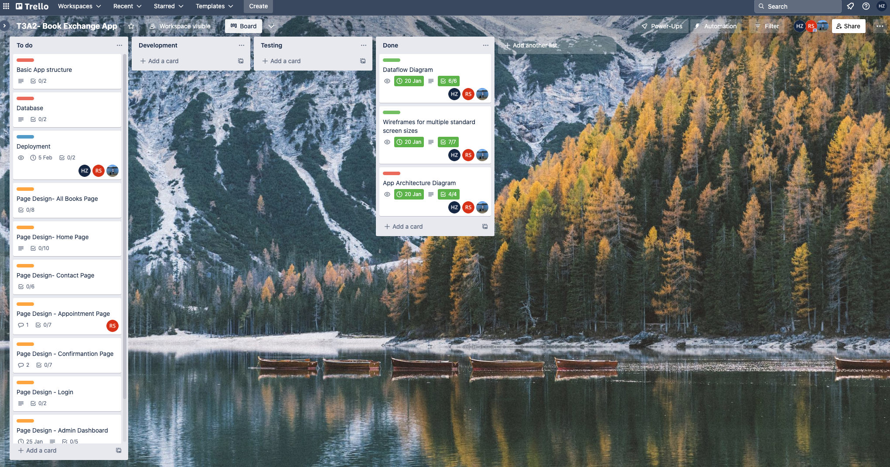

# R13 A link and screenshots of your Trello board throughout the duration of the project

Link to the trello board: https://trello.com/b/T9dwZzA3/t3a2-book-exchange-app
---
After submitting the part A assignment, we started doing the coding for the app by following on the Trello board. We created many lists for each part, even though the front-end and back-end parts in the Trello. The reason is we can create a checklist and add as many items as we need to define what functions or features we need in each parts. For example, as Ryan is good at back-end development such as the base of API Routes and database so he is in charge of that. And then, Hanzhi and Raymond are mainly in charge of the front-end development such as css styling and each components. For example, nav bar, footer, search function and their stylings.
Moreover, we have the meeting every weekday and discuss how to finish the process of that day by using Discord. Once we finished the items or goals in each list , we ticked those items to notice that parts are completed. In the Trello board, we can move each lists from different columns, which is very convenient for define which lists are developing and which one are completed. In addition, we can set the due date for the list to define which lists should be finish first and set who want to in charge some specific lists, for example, Ryan feels confidence to handle the back-end part that's why he puts down his name in some back-end lists.
In this whole group project, we will keep in touch and help each others when we have any questions or problems that cannot be resolved such as errors, bugs etc. 

### This is the details of the Trello board of the project below:

The details of creating API Routes

The details of creating the Confirm Component
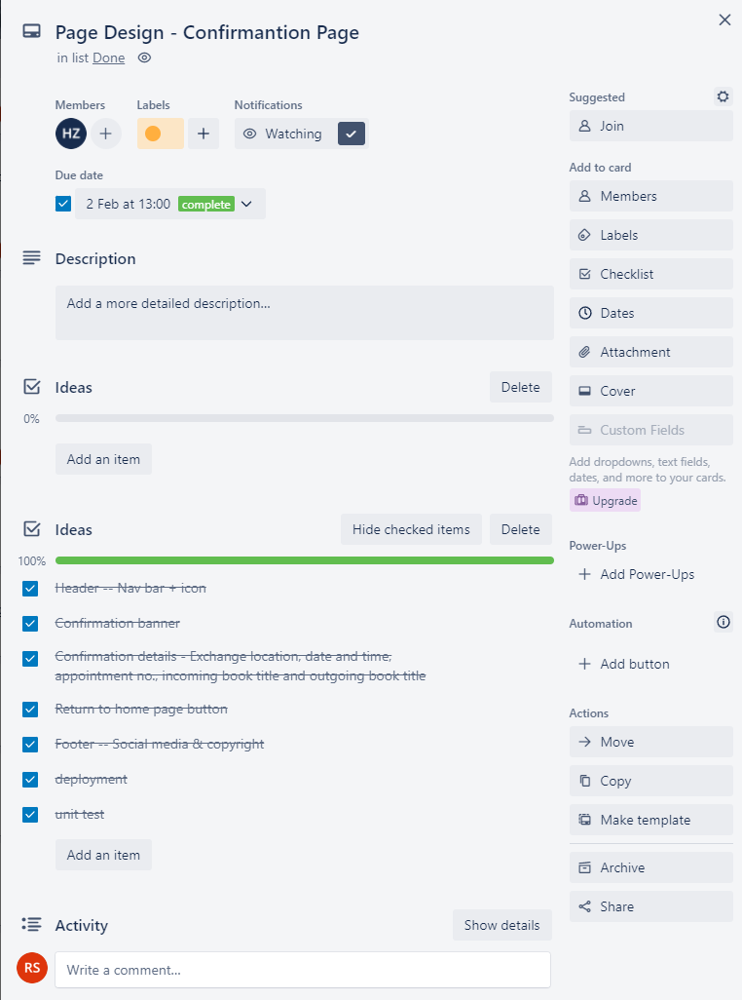

The details of creating the Home Page Component

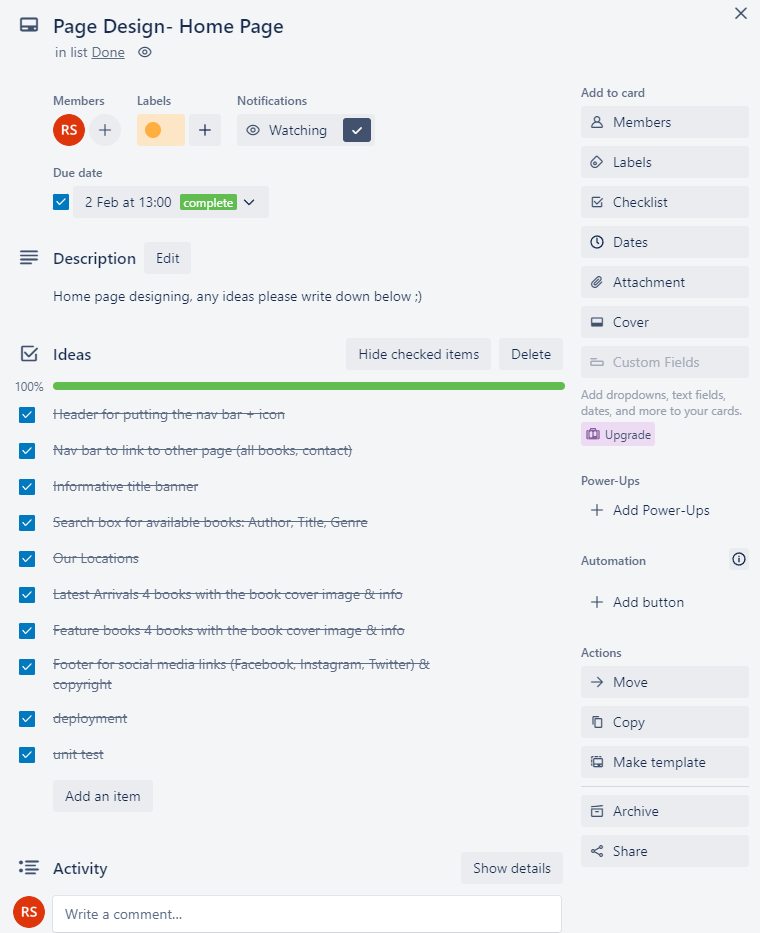

Day 8 - Tue 24 Jan

Day 9 - Wed 25 Jan

Day 11 - Fri 27 Jan

Day 17 - Thu 2 Feb

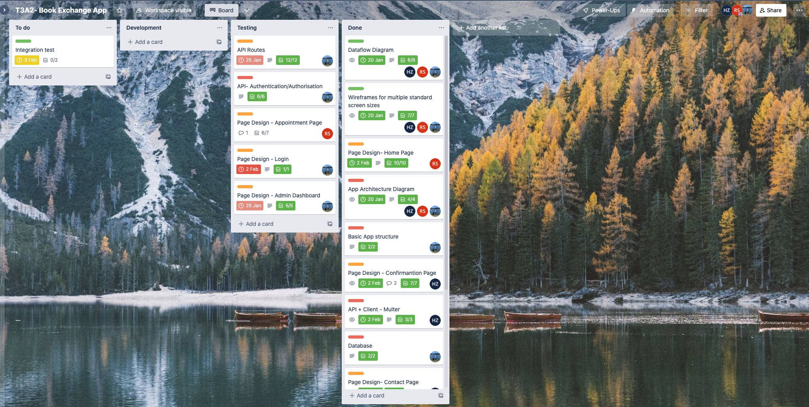

Day 19 - Sat 4 Feb

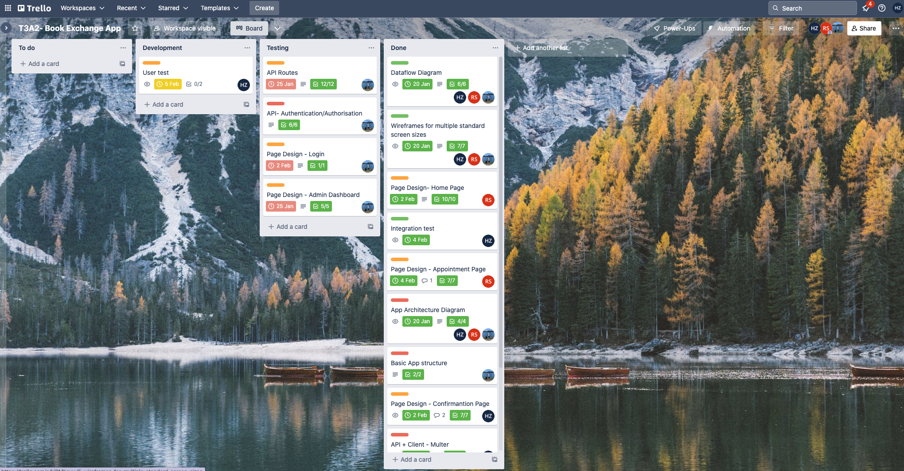

Day 20 - Sun 5 Feb

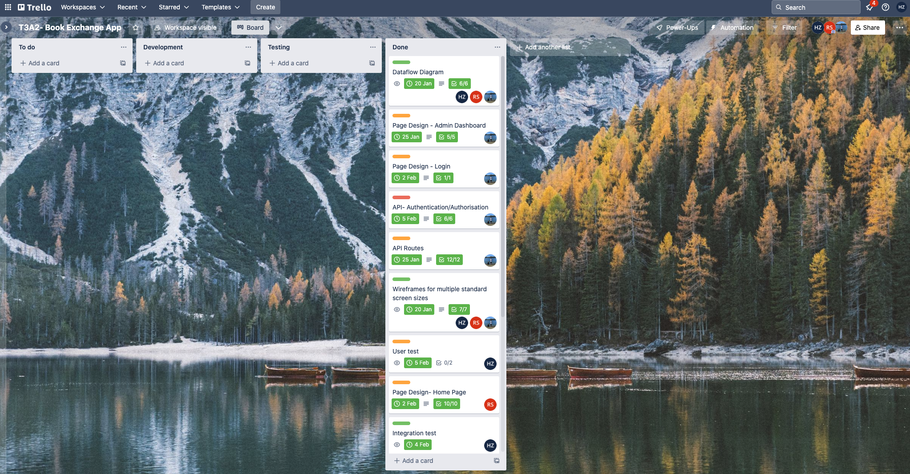
